<!-- configuracion de colores es opcional pero ultil-->
<section id="themes">
	<h2>Configuración de temas</h2>
	

		Temas:  
		<a href="?#/themes">Default</a> -
		<a href="?theme=sky#/themes">Sky</a> -
		<a href="?theme=beige#/themes">Beige</a> -
		<a href="?theme=simple#/themes">Simple</a> -
		<a href="?theme=serif#/themes">Serif</a> -
		<a href="?theme=night#/themes">Night</a>  
		<a href="?theme=moon#/themes">Moon</a> -
		<a href="?theme=solarized#/themes">Solarized</a>
	

</section>

Slide:

# Musear

Gino Forero

Slide:

## Musear

Aplicación basado en realidad aumentada
para mejorar la interacción en los museos

Slide:

## Problema

Muchas veces cuando se es turista se desean conocer , aprender y
visitar los espacios mas importantes de un lugar, entre los cuales
están los museos los cuales nos enseñan de la cultura, pero donde
están ubicados? Como llego? En mi recorrido aprenderé algo?

Slide:
## Un lugar por conocer
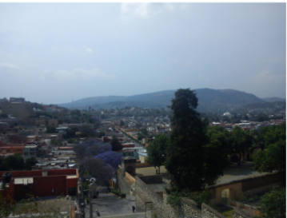

Slide:

## Porque no aprender mas de este retrato
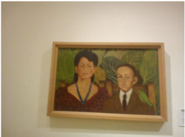
Slide:

## Te gustaría hacer tu recorrido divertido
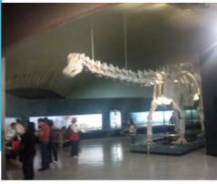
Slide:

## Te gustaría hacer tu recorrido divertido

Slide:

## Quieres aprender sobre las culturas
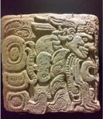
Slide:

## Quieres aprender sobre las culturas
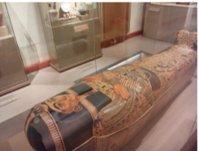

Slide:

## Existen proyectos que relacionan esto?
Existen algunos proyectos que presentan u recorrido virtual, otras
simplemente son audios y algunas individualmente solo presentan
texto, la aplicación que mas se acerca al objetivo es google
goggles.

Slide:

## Wikitude
Esta aplicación permite ver los hoteles y
restaurantes, en la pantalla de tu
dispositivo con puntos marcados y
distancia que te separa de los lugares más
cercanos del tipo de local que se esté
buscando.

Slide:

## Guggenheim Bilbao
Esta aplicación es más completa,
pues presenta un conjunto de
informaciones con texto, imágenes y
audios sobre el Guggenheim Bilbao.

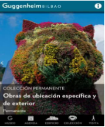

Slide:

## Museo Nacional del Prado
Esta aplicación funciona como un
audio guía que lleva a los usuarios
a descubrir las obras más
destacadas de la colección, con
detalles y curiosidades.

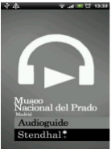

Slide:

## Objetivo
Desarrollar una aplicación móvil que permita a los usuarios
conocer la ubicación de los museos, eventos, además de lograr
una interacción y llevar un conocimiento a los usuarios de esta.

Slide:

## limitaciones

+Con Unity no se pueden obtener ingresos superiores a
USD 100 000, porque ya el tipo de licencia que ellos otorgan
cambia.
+Vuforia solo permite reconocer mil veces el conjunto imágenes de
la base de datos para desarrolladores, después de esto cobra.
+Las limitaciones que ofrece Unity free.
limitaciones
+La falta de modelos 3D relacionados con las obras que existen en
los museos.
+La falta de videos y audio que acompañen las proyecciones.
+Algunos museos son celosos con la información que ofrecen y con
el uso de cámaras.
+Las personas encargadas de ofrecer los tours se pueden
incomodar

Slide:

# Energía inicial

Desarrollando la versión base y realizando cierta publicidad, creo
que los diseñadores y Museos se podrían animar a contribuir y
colaborar en el proyecto

Slide:
# Herramientas
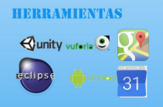

Slide:

# Actividades
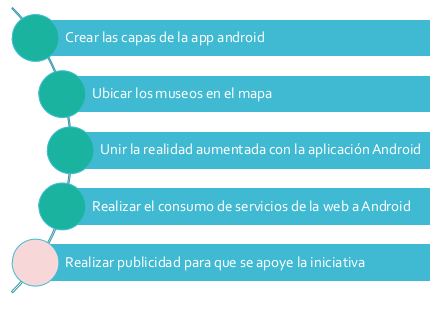

Slide:

## Actividades

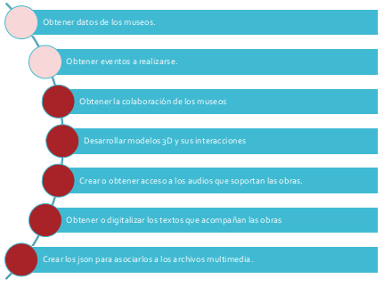

Slide:

## Búsqueda de museos

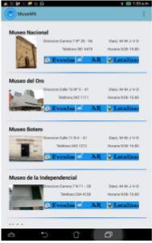
Slide:

## Búsqueda de eventos
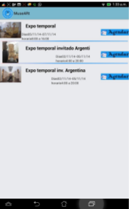

Slide:

## Encontrar el museo desde mi ubicación

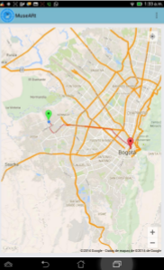

Slide:

## Forma de escaneo de vuforia

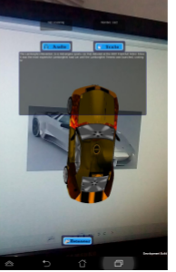
Slide:

## Obtener información de la obra de arte
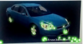

